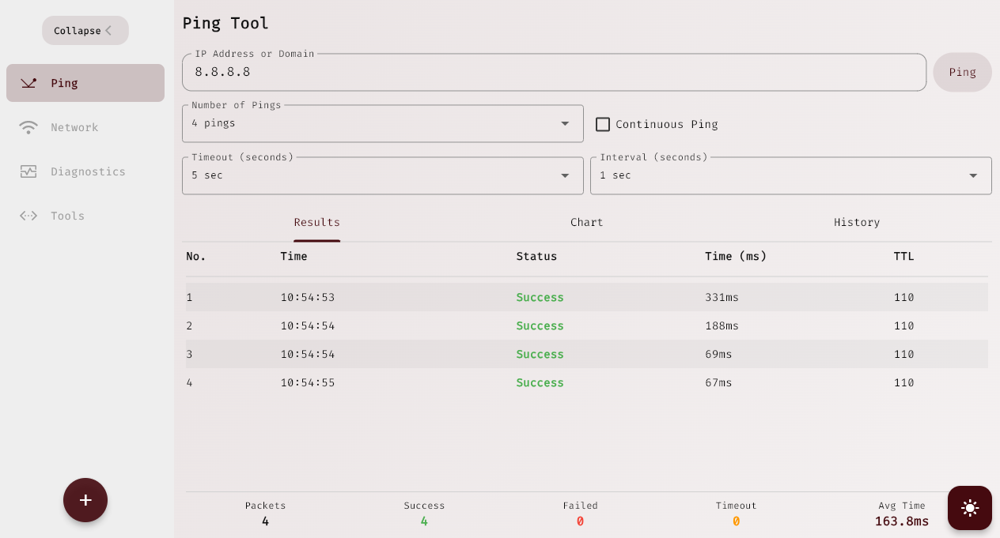
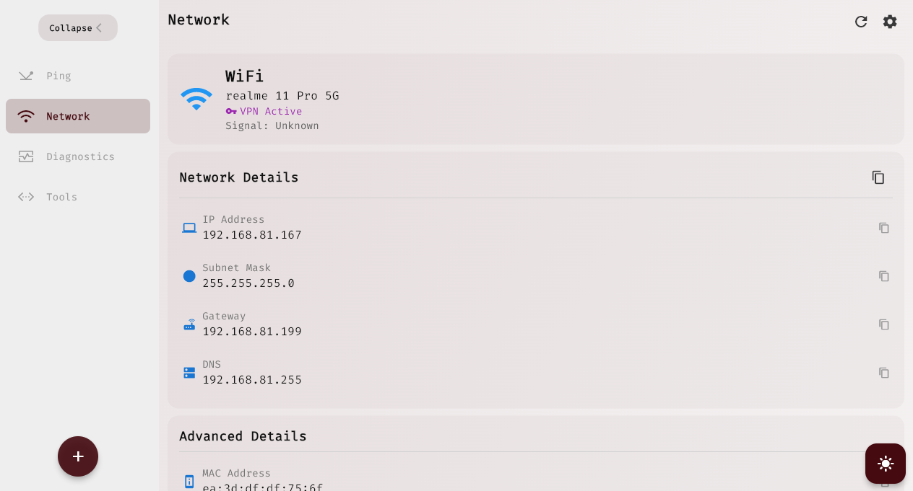
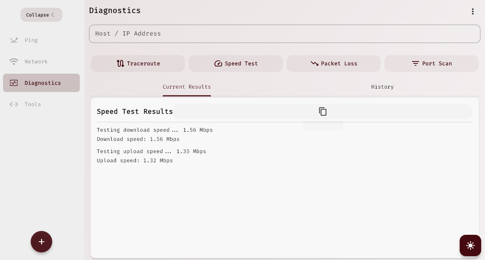
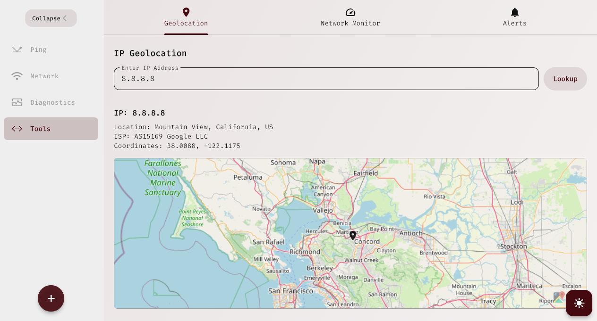

<p align="center">
  
</p>

# Pulse

A **network diagnostics and monitoring** app for Windows, macOS, Linux, Android and iOS, built with Flutter in the bold, hard-edged **Wire** design.

## Download

[](https://github.com/theprantadutta/pulse/releases/download/v1.0.0/pulse_windows_v1.0.0.msix)  
[](https://github.com/theprantadutta/pulse/releases/download/v1.0.0/pulse_android_v1.0.0.apk)


## Features

- **Ping** – live latency, loss, jitter and a reply log; run up to 32 **named pings at once** (Office PC, Library PC…) on a board, save named targets and find them later in History.
- **Traceroute** – every hop with per-probe times, countries, a route diagram and a plain-language "biggest jump".
- **Port scan** – common, 1–1024 or custom ranges with a port map, service names and banners.
- **Speed test** – download/upload/ping/jitter against Cloudflare or Hetzner servers.
- **Packet loss test** – per-packet timeline, burst detection and a verdict; compare against 1.1.1.1.
- **Network info** – SSID, Wi-Fi standard, band, channel, security, signal, addressing, public IP, ISP and ASN.
- **LAN scan** – devices with names, vendors (MAC OUI), types and open ports; Wake-on-LAN.
- **Geo IP** – locate any host on a map with distance, RTT and hops.
- **Monitor & Alerts** – background checks with uptime strips and incidents; rules for latency, loss, outages and new LAN devices, delivered as notifications, tray alerts or sound. Runs from the system tray on desktop and as a background service on Android/iOS.
- **History** – every session, searchable, exportable as CSV/TXT.

## Installation

### Prerequisites
- Flutter 3.47+ ([Get Flutter](https://flutter.dev/docs/get-started/install))
- Windows builds: Visual Studio 2022 with **Desktop development with C++** and the **C++ ATL for latest build tools** component (needed by the notifications plugin)
- Linux builds: `libgtk-3-dev libx11-dev libxi-dev`
- Optional: `.env` with `IP_INFO_TOKEN=<ipinfo.io token>` for the Geo IP fallback

### Steps
```sh
# Clone the repo
git clone https://github.com/theprantadutta/pulse
cd pulse

# Install dependencies
flutter pub get

# Run the app
flutter run
```

## Screenshots

<p align="center">
  
  
</p>

<p align="center">
  
  
</p>


## Contributing
Feel free to submit pull requests to improve **Pulse**.

## License
This project is licensed under the **Apache License**.

---
Made with ❤️ using Flutter!

